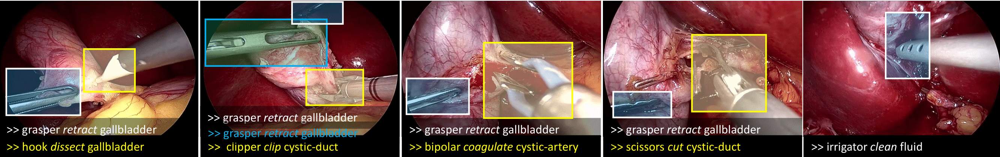

# Attention Tripnet:
**Exploiting attention mechanisms for the recognition of surgical action triplets in endoscopic videos**

<i>CI Nwoye, T Yu, C Gonzalez, B Seeliger, P Mascagni, D Mutter, J Marescaux, and N Padoy</i>

This repository contains the implementation code, inference demo, and evaluation scripts.  

# Introduction
Out of all existing frameworks for surgical workflow analysis in endoscopic videos, action triplet recognition stands out as the only one aiming to provide truly fine-grained and comprehensive information on surgical activities. This information, presented as <instrument, verb, target> combinations, is highly challenging to be accurately identified. Triplet components can be difficult to recognize individually; in this task,
it requires not only performing recognition simultaneously for all three triplet components, but also correctly establishing the data association between them.
To achieve this task, we introduce our new model, the <i>Rendezvous</i> (RDV), which recognizes triplets directly from surgical videos by leveraging attention at two different levels.
We first introduce a new form of spatial attention to capture individual action triplet components in a scene; called the <i>Class Activation Guided Attention Mechanism</i> (CAGAM). This technique focuses on the recognition of verbs and targets using activations resulting from instruments.
To solve the association problem, our RDV model adds a new form of semantic attention inspired by Transformer networks. Using multiple heads of cross and self attentions, RDV is able to effectively capture relationships between instruments, verbs, and targets. 
We also introduce <i>CholecT50</i> - a dataset of 50 endoscopic videos in which <i>every</i> frame has been annotated with labels from 100 triplet classes.
Our proposed RDV model significantly improves the triplet prediction mAP by over 9% compared to the state-of-the-art methods on this dataset.
 
Attention Tripnet is an ablation model of Rendezvous which uses the CAGAM in Rendezvous and 3Dis in Tripnet for triplet components detection and association respectively.

# Model

<b>Coming soon ...</b>

