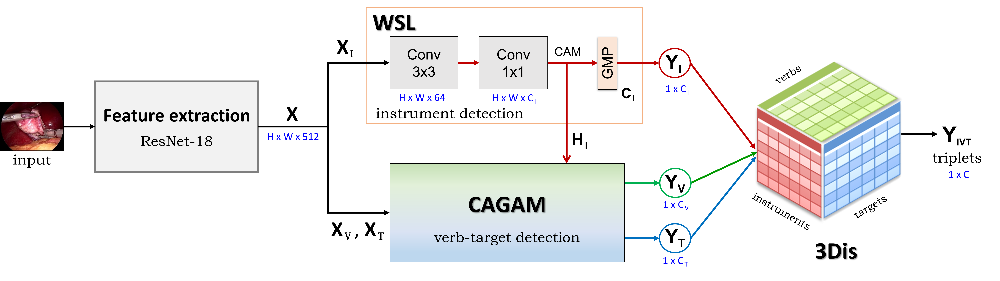
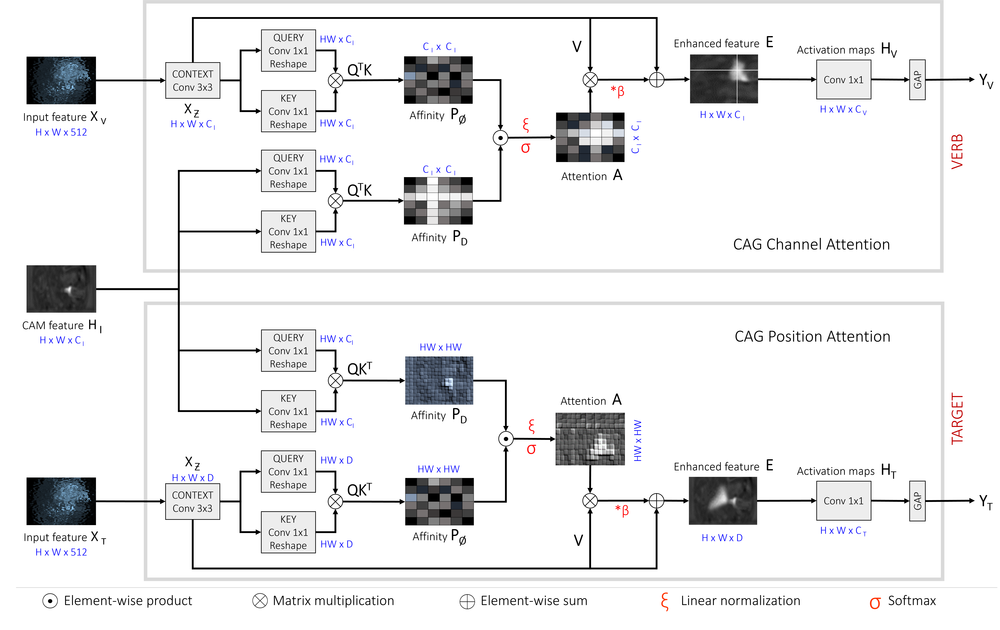

<div align="center">
<a href="http://camma.u-strasbg.fr/">

</a>
</div>
<br/>

  [](https://hamzamohdzubair.github.io/redant/)

# **Attention Tripnet**: Exploiting attention mechanisms for the recognition of surgical action triplets in endoscopic videos


<i>C.I. Nwoye and N. Padoy</i>

#

This repo contains an ablation model of [Rendezvous](https://github.com/CAMMA-public/rendezvous) network, known as `Attention Tripnet`. <br /> [](https://arxiv.org/abs/2109.03223) [](https://doi.org/10.1016/j.media.2022.102433)


<br />


# Introduction
Recognising action as a triplet of subject, verb, and object provides truly fine-grained and comprehensive information on surgical activities. In the natural vision, it model as <subject, verb, object> representing the Human Object Interaction (HOI). In Surgical Computer Vision, the information is presented as <instrument, verb, target>. Triplet recognition involves simultaneous recognition of all three triplet components and correctly establishing the data association between them.

A lot of efforts has been made to recognize surgical triplets directly from videos. The predominant ones include Tripnet and Rendezvous models leveraging class activations and attention mechanisms.

<br />

 

*Fig 1: Architecture of Attention Tripnet.*

The first effort at exploiting attention mechanisms in this Rendezvous led to the development of a Class Activation Guided Attention Mechanism (CAGAM) to better detect the verb and target components of the triplet, which are instrument-centric. CAGAM is a form of spatial attention mechanism that propagates attention from a known to an unknown context features thereby enhancing the unknown context for relevant pattern discovery. Usually the known context feature is a class activation map (CAM). In this work, CAGAM explicitly uses tool type and location information to highlight discriminative features for verbs and targets respectively. Integrating CAGAM in the state-of-the-art Tripnet model results in a new model that is now known as Attention Tripnet with improved performance.

<br />



*Fig 2: Overview of CAGAM.*


<br />


# Model Overview


The Attention-Tripnet model is composed of:
* Feature Extraction layer: extract high and low level features from input image from a video
* Encoder: for triplet components encoding
    * Weakly-Supervised Localization (WSL) Layer: for localizing the instruments
    * Class Activation Guided Attention Mechanism (CAGAM): for detecting the verbs and targets leveraging attention resulting from instrument activations. (channel anad position spatial attentions are used here)
* Decoder: for triplet assocaition due to multi-instances
    * 3D interaction space (3Dis): for learning to associate instrument-verb-target using a learning projection and for final triplet classification.

<br />


We hope this repo will help researches/engineers in the development of surgical action recognition systems. For algorithm development, we provide training data, baseline models and evaluation methods to make a level playground. For application usage, we also provide a small video demo that takes raw videos as input without any bells and whistles.

<br />


# Performance

## Results Table


||Components AP ||||| Association AP |||
:---:|:---:|:---:|:---: |:---:|:---:|:---:|:---:|:---:|
AP<sub>I</sub> | AP<sub>V</sub> | AP<sub>T</sub> ||| AP<sub>IV</sub> | AP<sub>IT</sub> | AP<sub>IVT</sub> |
92.0 | 60.2 | 38.5 ||| 31.1 | 29.8 | 23.4|

<br />

## Video Demo

Usefulness of CAGAM is demonstrated at the second phase of the video:

<a href="https://www.youtube.com/watch?v=d_yHdJtCa98&t=61s"></a>

Available on Youtube.

<br />


# Installation

## Requirements

The model depends on the following libraries:
1. sklearn
2. PIL
3. Python >= 3.5
4. ivtmetrics
5. Developer's framework:
    1. For Tensorflow version 1:
        * TF >= 1.10
    2. For Tensorflow version 2:
        * TF >= 2.1
    3. For PyTorch version:
        - Pyorch >= 1.10.1
        - TorchVision >= 0.11

<br />

## System Requirements:

The code has been test on Linux operating system. It runs on both CPU and GPU.
Equivalence of basic OS commands such as _unzip, cd, wget_, etc. will be needed to run in Windows or Mac OS.

<br />

## Quick Start

* clone the git repository: ``` git clone https://github.com/CAMMA-public/rendezvous.git ```
* install all the required libraries according to chosen your framework.
* download the dataset
* download model's weights
* train
* evaluate

<br />


# Dataset Zoo

* [CholecT45](https://github.com/CAMMA-public/cholect45) 
* CholecT50
* [Dataset splits](https://arxiv.org/abs/2204.05235)

<br />

## Data Preparation

* All frames are resized to 256 x 448 during training and evaluation.
* Image data are mean normalized.
* The dataset variants are tagged in this code as follows: 
   - cholect50 = CholecT50 with split used in the original paper.
   - cholect50-challenge = CholecT50 with split used in the CholecTriplet challenge.
   - cholect45-crossval = CholecT45 with official cross-val split **(currently public released)**.
   - cholect50-crossval = CholecT50 with official cross-val split.

<br />


## Evaluation Metrics

The *ivtmetrics* computes AP for triplet recognition. It also support the evaluation of the recognition of the triplet components.
```
pip install ivtmetrics
```
or
```
conda install -c nwoye ivtmetrics
```
Usage guide is found on [pypi.org](https://pypi.org/project/ivtmetrics/).

<br />


# Running the Model

The code can be run in a trianing mode (`-t`) or testing mode (`-e`)  or both (`-t -e`) if you want to evaluate at the end of training :

<br />

## Training on CholecT45/CholecT50 Dataset

Simple training on CholecT50 dataset:
```
python run.py -t  --data_dir="/path/to/dataset" --dataset_variant=cholect50 --version=1
```

You can include more details such as epoch, batch size, cross-validation and evaluation fold, weight initialization, learning rates for all subtasks, etc.:

```
python3 run.py -t -e  --data_dir="/path/to/dataset" --dataset_variant=cholect45-crossval --kfold=1 --epochs=180 --batch=64 --version=2 -l 1e-2 1e-3 1e-4 --pretrain_dir='path/to/imagenet/weights'
```

All the flags can been seen in the `run.py` file.
The experimental setup of the published model is contained in the paper.

<br />

## Testing

```
python3 run.py -e --dataset_variant=cholect45-crossval --kfold 3 --batch 32 --version=1 --test_ckpt="/path/to/model-k3/weights" --data_dir="/path/to/dataset"
```

<br />

## Training on Custom Dataset

Adding custom datasets is quite simple, what you need to do are:
- organize your annotation files in the same format as in [CholecT45](https://github.com/CAMMA-public/cholect45) dataset. 
- final model layers can be modified to suit your task by changing the class-size (num_tool_classes, num_verb_classes, num_target_classes, num_triplet_classes) in the argparse.

<br />


# Model Zoo

* **N.B.** Download links to models' weights will not be provided until after the CholecTriplet2022 challenge.


## PyTorch

| Network   | Base      | Resolution | Dataset   | Data split  |  Link             |
------------|-----------|------------|-----------|-------------|-------------------|
| Attention Tripnet| ResNet-18 | Low        | CholecT50 | RDV         |   [Google] [Baidu] |
| Attention Tripnet| ResNet-18 | High       | CholecT50 | RDV         |   [Google] [Baidu] |
| Attention Tripnet| ResNet-18 | Low        | CholecT50 | Challenge   |   [Google] [Baidu] |
------------

<br />

## TensorFlow v1

| Network   | Base      | Resolution | Dataset   | Data split    | Link             |
------------|-----------|------------|-----------|---------------|------------------|
| Attention Tripnet| ResNet-18 | High       | CholecT50 | RDV           |  [Google] [Baidu] |
| Attention Tripnet| ResNet-18 | High       | CholecT50 | Challenge     |  [Google] [Baidu] |

<br />

## TensorFlow v2

| Network   | Base      | Resolution | Dataset   | Data split    | Link             |
------------|-----------|------------|-----------|---------------|------------------|
| Attention Tripnet| ResNet-18 | High       | CholecT50 | RDV           |   [Google] [Baidu] |
| Attention Tripnet| ResNet-18 | Low        | CholecT50 | RDV           |   [Google] [Baidu] |
| Attention Tripnet| ResNet-18 | High       | CholecT50 | Challenge     |   [Google] [Baidu] |
------------

Model weights are released periodically because some training are in progress.

<br /><br />


# License


This code, models, and datasets are available for **non-commercial scientific research purposes** provided by [CC BY-NC-SA 4.0 LICENSE](https://creativecommons.org/licenses/by-nc-sa/4.0/) attached as [LICENSE file](LICENSE). 
By downloading and using this code you agree to the terms in the [LICENSE](LICENSE). Third-party codes are subject to their respective licenses.


<br />


# Related Resources
<b>
   
-  CholecT45 / CholecT50 Datasets
   [](http://camma.u-strasbg.fr/datasets)    [](https://github.com/CAMMA-public/cholect45)   
-  Offical Dataset Splits 
   [](https://arxiv.org/abs/2204.05235)
-  Tripnet 
   [](https://arxiv.org/abs/2007.05405)    [](https://github.com/CAMMA-public/tripnet)   
-  Rendezvous 
    [](https://arxiv.org/abs/2109.03223)     [](https://doi.org/10.1016/j.media.2022.102433) [](https://github.com/CAMMA-public/rendezvous) 
-  CholecTriplet2021 Challenge
   [](https://cholectriplet2021.grand-challenge.org)    [](https://arxiv.org/abs/2204.04746)    [](https://github.com/CAMMA-public/cholectriplet2022) 
-  CholecTriplet2022 Challenge
   [](https://cholectriplet2022.grand-challenge.org)    [](https://github.com/CAMMA-public/cholectriplet2022)
 
</b>

<br />


# Citation
If you find this repo useful in your project or research, please consider citing the relevant publications:

- For the CholecT45/CholecT50 Dataset:
```
@article{nwoye2021rendezvous,
  title={Rendezvous: Attention Mechanisms for the Recognition of Surgical Action Triplets in Endoscopic Videos},
  author={Nwoye, Chinedu Innocent and Yu, Tong and Gonzalez, Cristians and Seeliger, Barbara and Mascagni, Pietro and Mutter, Didier and Marescaux, Jacques and Padoy, Nicolas},
  journal={Medical Image Analysis},
  volume={78},
  pages={102433},
  year={2022}
}
```


- For the CholecT45/CholecT50 Official Dataset Splits:
```
@article{nwoye2022data,
  title={Data Splits and Metrics for Benchmarking Methods on Surgical Action Triplet Datasets},
  author={Nwoye, Chinedu Innocent and Padoy, Nicolas},
  journal={arXiv preprint arXiv:2204.05235},
  year={2022}
}
```


- For the Rendezvous or Attention Tripnet Baseline Models or any snippet of code from this repo:
```
@article{nwoye2021rendezvous,
  title={Rendezvous: Attention Mechanisms for the Recognition of Surgical Action Triplets in Endoscopic Videos},
  author={Nwoye, Chinedu Innocent and Yu, Tong and Gonzalez, Cristians and Seeliger, Barbara and Mascagni, Pietro and Mutter, Didier and Marescaux, Jacques and Padoy, Nicolas},
  journal={Medical Image Analysis},
  volume={78},
  pages={102433},
  year={2022}
}
```

- For the Tripnet Baseline Model:
```
@inproceedings{nwoye2020recognition,
   title={Recognition of instrument-tissue interactions in endoscopic videos via action triplets},
   author={Nwoye, Chinedu Innocent and Gonzalez, Cristians and Yu, Tong and Mascagni, Pietro and Mutter, Didier and Marescaux, Jacques and Padoy, Nicolas},
   booktitle={International Conference on Medical Image Computing and Computer-Assisted Intervention (MICCAI)},
   pages={364--374},
   year={2020},
   organization={Springer}
}
```


- For the models presented @ CholecTriplet2021 Challenge:
```
@article{nwoye2022cholectriplet2021,
  title={CholecTriplet2021: a benchmark challenge for surgical action triplet recognition},
  author={Nwoye, Chinedu Innocent and Alapatt, Deepak and Vardazaryan, Armine ... Gonzalez, Cristians and Padoy, Nicolas},
  journal={arXiv preprint arXiv:2204.04746},
  year={2022}
}
```

#
This repo is maintained by [CAMMA](http://camma.u-strasbg.fr). Comments and suggestions on models are welcomed. Check this page for updates.